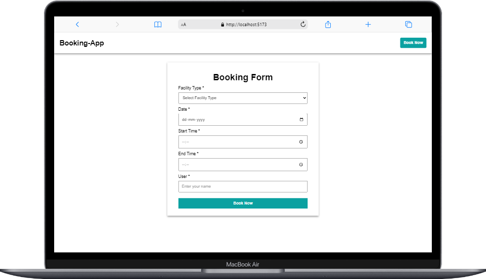
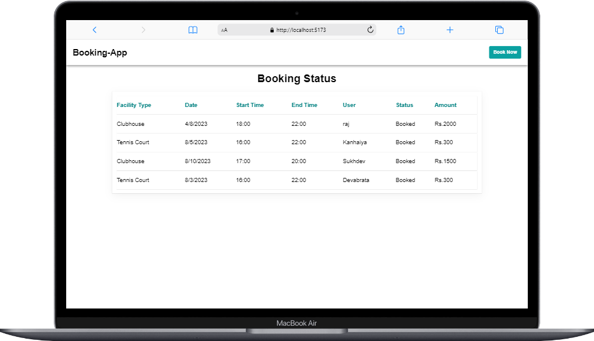

<h1 align="center">Booking App</h1>

<h3 align="center">It's a Booking Application</h3>

 

<h2 align="center">🖥️ Tech Stack</h2>

<h4 align="center">Frontend:</h4>

  
   
   
   
    

<h4 align="center">Deployed On:</h4>

  
 

 

## Booking Form

 

## Booking Status

 

## Getting Started

-> To get started with the project, follow these steps:

1. Clone the repository to your local machine.
2. Install the required dependencies by running npm install.
3. Start the backend server by running npm run start.
4. Start the frontend server by running npm run dev.
5. Open your browser and navigate to http://localhost:5173 to view the app.

# Deployed Link

### Frontend
https://adda-orignal.netlify.app/

### Backend

https://adda-server-2ql6.onrender.com
